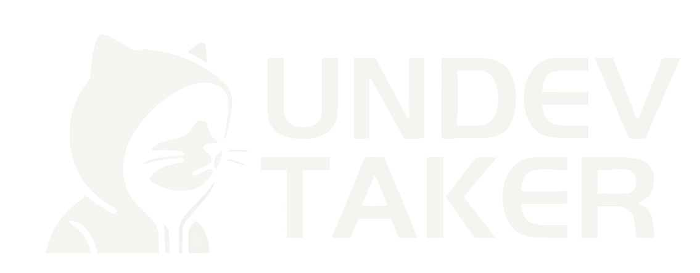

# TCG Hub: Inventory & Store

## 📋 Tablero del Proyecto

[Tablero del proyecto](https://github.com/users/unDEVtaker/projects/5)

## 📖 Descripción

**TCG Hub** es un marketplace especializado en la compra, venta y gestión de cartas coleccionables de juegos de mesa y trading card games (TCG), con un enfoque principal en **Pokémon TCG**. 
El objetivo es ofrecer a jugadores y coleccionistas un espacio confiable y fácil de usar para encontrar cartas, sets y productos relacionados con sus intereses.

## 🎯 Público objetivo

- **Aficionados y entusiastas**: Usuarios que disfrutan del TCG como un pasatiempo ocasional y desean explorar productos sin un enfoque competitivo.
- **Coleccionistas apasionados**: Personas interesadas en adquirir cartas raras, exclusivas o graduadas para enriquecer sus colecciones.
- **Jugadores casuales y principiantes**: Personas que están dando sus primeros pasos en el mundo del TCG y buscan cartas o sets accesibles para iniciarse.
- **Jugadores competitivos**: Aquellos que buscan cartas específicas para armar mazos competitivos.
- **Revendedores y comerciantes**: Usuarios que desean publicar y vender cartas o productos relacionados en un entorno seguro.  

## ✨ Características principales

- **Filtro por condición**: Encuentra cartas en estados como Mint, Near Mint, o incluso certificadas por PSA/BGS.  
- **Categorías claras**: Desde cartas individuales hasta sets sellados y accesorios.  
- **Interfaz intuitiva**: Diseñada para facilitar la búsqueda y compra de cartas.  
- **Análisis de mercado**: En cada página de detalle del producto, los usuarios podrán visualizar un gráfico con el historial de precios de la carta. Este gráfico utiliza una API especializada para mostrar tendencias de mercado, permitiendo a los usuarios evaluar si el precio podría subir o bajar en el futuro. Conexión a servicios como [TCGplayer API](https://www.apitcg.com/)

## 👤 Sobre el creador

👋 Hola, soy **Jonatan**.  
💻 Desarrollador backend.  
🌍 Con base en Argentina.  
📚 Estudiando una Tecnicatura en Programación en la Universidad Tecnológica Nacional (UTN).  
📖 Formándome en Desarrollo Web Full Stack en la Fundación FORMAR.

## 🌟 Inspiración: Referentes del mercado

Como parte del desarrollo de **TCG Hub**, investigue y analice diferentes sitios web relacionados con productos coleccionables y marketplaces.
A continuación, se presentan cinco referentes  que sirvieron de inspiración:

1. **[Mercado Libre](https://www.mercadolibre.com.ar/)**  
   - **Motivo**: Es uno de los marketplaces más grandes de Latinoamérica, conocido y utilizado por todos. Sirve como referencia para implementar una experiencia de usuario eficiente.
   

2. **[Total Cards](https://totalcards.net/)**  
   - **Motivo**: Sitio especializado en TCGs, con un enfoque claro en cartas individuales y productos relacionados. Su diseño intuitivo y categorización de productos los utilizo como inspiración para el desarrollo de **TCG Hub**.
    

3. **[TCGplayer](https://www.tcgplayer.com/)**  
   - **Motivo**: Es uno de los sitios más populares en la comunidad de cartas coleccionables. Inspiró funcionalidades como la integración de precios de mercado, historial de valores y opciones de compra/venta para usuarios.
    

4. **[Cardmarket](https://www.cardmarket.com/es/Pokemon)**  
   - **Motivo**: Sitio especializado en la compra y venta de cartas coleccionables de Pokémon. Su funcionalidad de gráficos para analizar precios de mercado y tendencias inspiró la idea de incluir una herramienta similar en **TCG Hub** para ofrecer a los usuarios datos útiles sobre la valorización de sus cartas.
   

5. **[Pokémon Center](https://www.pokemoncenter.com/)**  
   - **Motivo**: La tienda oficial de Pokémon tiene un diseño limpio, accesible y atractivo para los fanáticos.
   

Estos sitios fueron seleccionados por su relevancia en términos de productos, estética, funcionalidades, y público objetivo.
**TCG Hub** busca combinar lo mejor de cada uno para crear una experiencia única para jugadores y coleccionistas.

---

## 🖌 Diseño del Sitio

Para el diseño y planificación de la interfaz de usuario de **TCG Hub**, he creado un wireframe y un mockup utilizando **Figma**. 

- **Wireframe**:  
  [Visualiza el wireframe aquí](https://www.figma.com/design/e1qgiJAf7XDs0RHM8eHJ6e/TCG-Hub?node-id=234-295&t=OE0m9rAer90CP1ZC-1)  
  El wireframe define la estructura básica del sitio y permite entender la disposición de los elementos clave antes de desarrollar el diseño detallado.

- **Mockup**:  
  [Visualiza el mockup aquí](https://www.figma.com/design/e1qgiJAf7XDs0RHM8eHJ6e/TCG-Hub?node-id=0-1&t=DamcoFGHcnCwnFY3-1)  
  El mockup incluye los estilos, colores, y elementos visuales detallados que definen la apariencia final del sitio. Sirve como guía para mantener consistencia durante el desarrollo.

- **Tipografía**: La fuente principal utilizada en el sitio es [Anton SC](https://fonts.google.com/specimen/Anton+SC). Esta fuente fue seleccionada para asegurar una lectura clara y una estética moderna.

- **Colores**: Los colores seleccionados para el diseño son principalmente neutros (Hex: #000000, Hex: #ededed). Esto se debe a que las cartas de Pokémon y otros productos relacionados tienen colores muy llamativos, por lo que se buscó evitar saturar la pantalla y permitir que el diseño y los colores del sitio no interfieran con las imágenes de los productos.

---

## 👾 Dev => [unDEVtaker](https://github.com/unDEVtaker)

